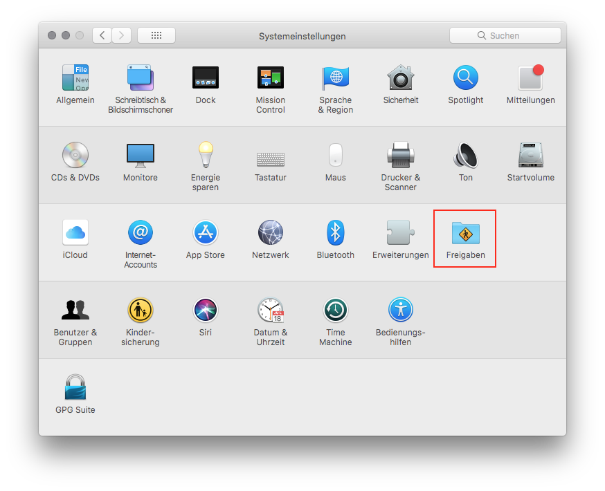
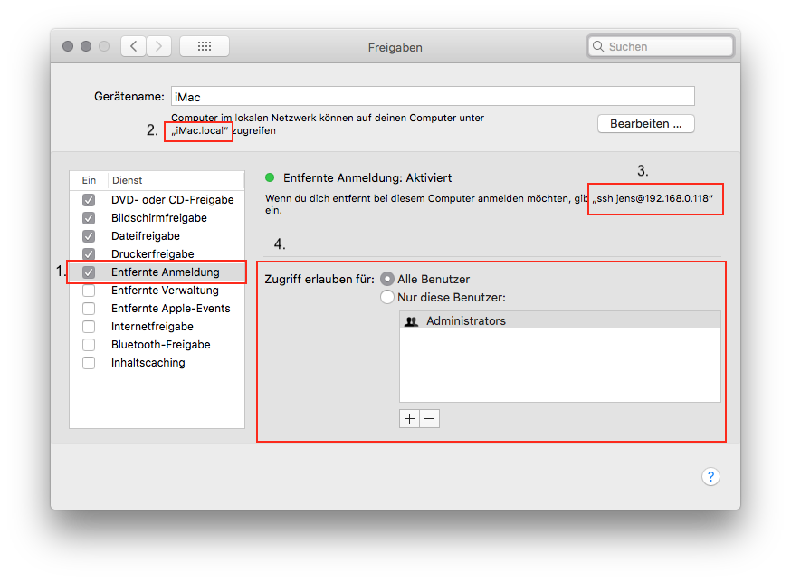
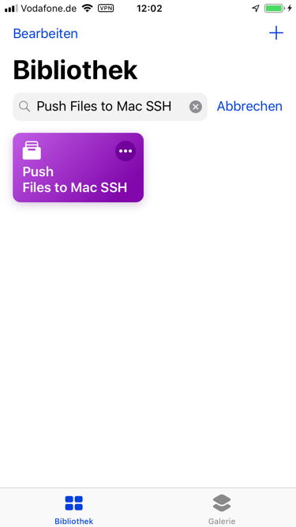
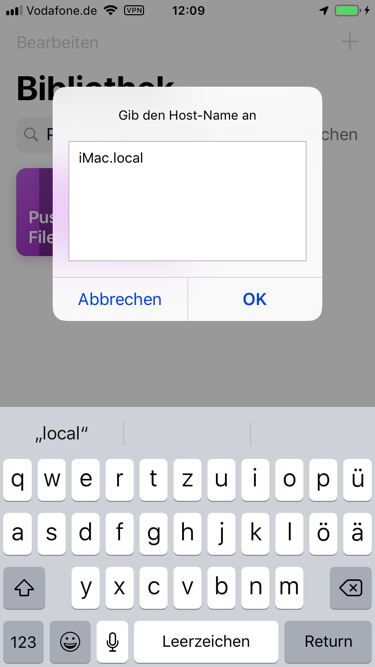
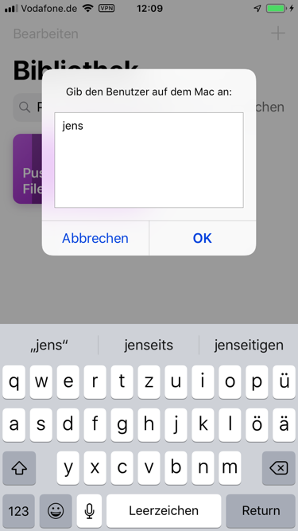
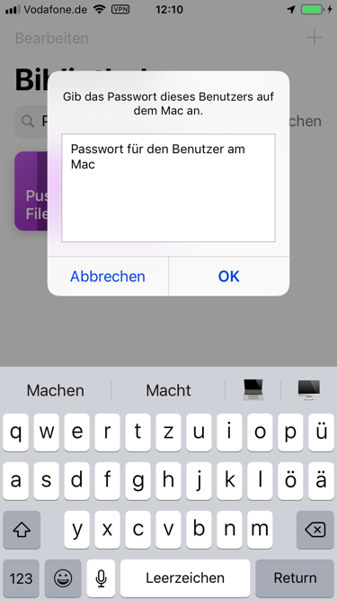
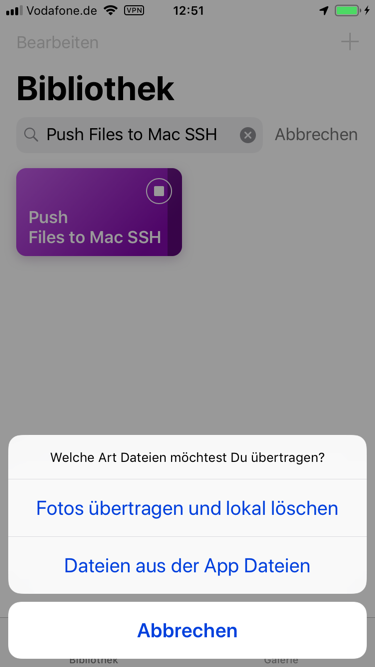
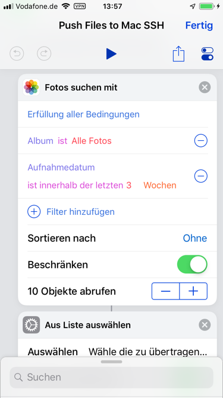
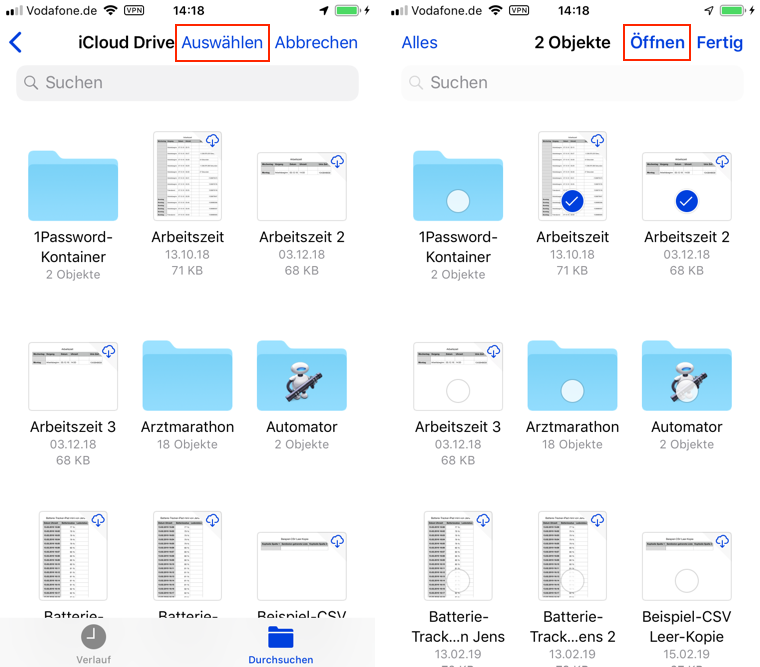
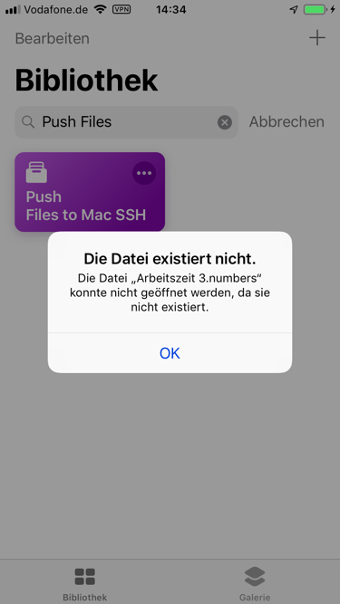

### Push Files to Mac SSH

---

**Push Files to Mac SSH** ist ein Kurzbefehl mit dem du Dateien und Fotos von deinem iDevice (iPhone, iPad, iPod) auf (d)einen Mac oder sonstigen Computer mit SSH-Zugang übertragen kannst. Dazu benötigst du einen aktivierten SSH-Zugang auf dem Zielrechner.

**Du fragst dich eventuell jetzt: Warum nicht einfach per Airdrop?**

Richtig, Airdrop bietet genau diese Funktion, aber mancher Mac ist schlicht zu alt für Airdrop zwischen Mac und iPhone.

---
## Vorbereitung auf dem Mac

### Die entfernte Anmeldung aktivieren

*Gehe dazu in die Systemeinstellungen und öffne Freigaben*

*Einstellungen Freigaben*

**1. Aktiviere "Entfernte Anmeldung"**

das aktiviert den SSH-Zugang auf dem Mac

**2. den Host-Namen ermitteln**

Notiere den Name in der Umrandung bei 2.

Dies ist der **Host**, diese Information benötigst du später im Kurzbefehl.

**3. den Benutzer ermitteln**

Der Benutzer entspricht dem Namen deines Home-Verzeichnis im Finder. Zur Sicherheit kannst du das hier überprüfen.

`ssh jens@192.168.0.118` ist der gesamte Befehl für eine Eingabe im Terminal um eine SSH-Verbindung zu diesem Mac zu öffnen.

Daraus benötigst du nur den Namen. in diesem Beispiel ist das `jens`

Dies ist der **Benutzer**, diese Information benötigst du später im Kurzbefehl.

**4. Zugriff erlauben für …**

Wenn Du Administrator bist kann "Nur diese Benutzer" aktiviert bleiben.
Wenn Du Standard-Benutzer auf dem Mac bist, aktiviere "Alle Benutzer", oder füge Dich als Benutzer zur Liste hinzu.

Schliesse die Systemeinstellungen. An dieser Stelle bist du auf dem Mac fertig.

---
## Weiter gehts auf dem iDevice

Du hast den Kurzbefehl heruntergeladen und in die App "Kurzbefehle" importiert.

### Öffne die App "Kurzbefehle"

#### Öffne den Kurzbefehl indem du auf diesen großen Button drückst.

Die drei Punkte in dem kleinen Kreis oben rechts öffnet den Kurzbefehl im Editor-Fenster. Wenn Du den Kurzbefehl dort öffnest, kannst du ihm bei der Arbeit zusehen.

Das verlangsamt allerdings das Ganze besonders bei sehr umfangreichen Kurzbefehlen Der Ablauf benötigt ein vielfaches der Zeit, die der sonst im normalen Ablauf im Bibliothek-Modus benötigen würde.

Das liegt einfach an dem Umstand, das das Gerät Rechenleistung für die grafische Darstellung des Ablaufes benötigt und diese dann bei der Ausführung des Kurzbefehls fehlt. Das bemerkt man gerade auf älteren Geräten bist einschliesslich dem iPhone 6s.

---
#### Also: Öffne den Kurzbefehl indem du auf diesen großen Button drückst.

---
#### Einmalig die Daten für den Login per SSH eingeben

Beim ersten Start wirst du nach den Login-Daten für den Mac/anderen Rechner gefragt.

**1. Host**

*Der Host-Name des Zielrechner*

---
**2. Benutzer**

*Dein Benutzername auf dem Zielrechner*

---
**3. Passwort**

*Das Passwort für den Benutzer auf dem Zielrechner*

---

#### Das war die Ersteinrichtung
Das siehst Du im Normalfall nie wieder. Außer du löscht die Login-Daten. Wie das funktioniert erfährst Du weiter unten.

---
#### Was passiert mit meinen eingegebenen Daten?

Diese eingegebenen Daten werden in einer JSON-Datei in deinem iCloud Drive gespeichert. Diese Datei ist versteckt und mit den normalen Dateien-App auf den iDevice nicht einsehbar.

Am Mac kannst du die Datei sehen, wenn du versteckte Dateien im Finder anzeigen lässt. ``Shift + cmd + .`` (Punkt) lassen die versteckten Dateien im Finder anzeigen. Diese Tastenkombination schaltet die Anzeige der versteckten Dateien auch wieder aus.

*Die Datei hat den folgenden Pfad:*

`iCloud Drive/Shortcuts/SSH/.login.json`

Da die App Kurzbefehle nicht aus ihrer Sandbox raus kann um Dateien zu speichern, kann diese Datei nicht weiter oben im Verzeichnis-Baum abgelegt werden.

---
#### Wie kann ich diese Daten löschen?

Das ist einfacher als gedacht. Du öffnest die App "Dateien" navigierst zum Ordner `iCloud Drive/Shortcuts` markierst den Ordner mit "Auswählen" bzw "Select" und löscht den Ordner "SSH" mit dem Papierkorb-Symbol.

Dadurch werden auch alle darin befindlichen Dateien vom Gerät entfernt.

---
#### Die eigentliche Benutzung des Kurzbefehles

Wenn die Login-Daten korrekt sind wird das Verzeichnis "Hauptordner" und "Unterordner" aus den Einstellungen des Kurzbefehles ausgelesen und die Ordner werden per SSH auf dem Ziel-Rechner erstellt.

Standard ist `~/Desktop/Ordner` wobei "Ordner" den Namen des Gerätemodell enthält. So erhältst Du einen neuen Ordner "Unterordner-Name des Gerätes" Den Namen "Unterordner" hast du bei der Einrichtung festgelegt oder belassen. Dann heißt er bei einem iPhone: `Testordner-iPhone`

Als nächstes erschein das Menü:

---
### 1. Fotos übertragen und lokal löschen

Du kannst Fotos nach verschiedenen Kriterien suchen lassen. Wenn du diesen Menüpunkt auswählst werden Fotos nach den festgelegten Filtern gesucht.

Hier kannst du dich nach Belieben austoben.

+ Anschliessend werden die gefundenen Fotos in einer kleinen Vorschau zur Auswahl dargestellt.
+ Du kannst einzelne Fotos abwählen.
+ Dann werden die markierten Fotos auf den Zielrechner übertragen
+ Danach werden die Fotos lokal gelöscht
+ Dabei erhältst Du wiederum eine Übersicht der zu löschenden Fotos und kannst einzelne abwählen, die nicht gelöscht werden sollen.
+ Das Löschen musst du bestätigen, dieser Schritt lässt sich nicht überspringen.
---
### 2. Dateien vom iPhone übertragen

#### Auswahl der Dateien

Das Übertragen von Dateien aller Art verhält sich quasi analog, ist nur nicht so umfangreich.
+ Du bekommst eine Auswahlansicht der Dateien-App und kannst eine oder mehrere Dateien auswählen.
+ Diese werden dann in das festgelegte Verzeichnis übertragen.

+ Eine einzelne Datei wählst du einfach durch antippen aus.
+ Mehrere Dateien:
  - Wähle "Auswählen"
  - Markiere die gewünschten Dateien
  - **Öffne** die Dateien

***Fertig*** beendet nur den Auswahldialog ohne Dateien zu markieren.

---

#### Das war es dann auch schon. Die Dateien werden übertragen und der Kurzbefehl ist fertig.

---
#### Fehlermeldung bei nicht heruntergeladenen Dateien

Wenn Du mehrere Dateien übertragen möchtest, die nicht heruntergeladen wurden, sondern nur in der iCloud liegen erhältst Du eine Fehlermeldung:

Eine einzelne Datei hingegen wird bei der Auswahl heruntergeladen und übernommen.

---
#### Geplante noch nicht realisierte Funktionen

- Speichern mehrerer Verbindungen
- Auswahl-Menü für verschiedene Zielordner
- UpdateKit-Integration

### Download

QR-Code für den schnellen Import mit dem integrierten QR-Scanner deine iDevices

Klassischer Download-Link im **Safari** deines iDevices.

[Link zum Kurzbefehl](https://www.icloud.com/shortcuts/0b5d3758204e4e948ddbe43a59ef1efb)

### Kontakt für Hilfe und Fragen

[Gehe zur Hauptseite](https://github.com/P8DFxKfyJB/MeinUpdatKit/blob/master/README.md)
