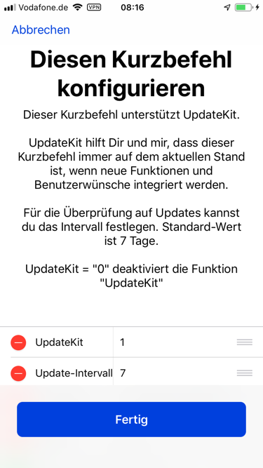

# Meine UpdateKit-Kurzbefehle

Hier findest du alle meine veröffentlichten Kurzbefehle. Ab August 2019 unterstützt jeder Kurzbefehl UpdateKit.

---
### Übersicht meiner bisher hier veröffentlichten Kurzbefehlen

[Link zu Meine UpdateKit-Kurzbefehle](https://github.com/P8DFxKfyJB/MeinUpdatKit/tree/master/Meine-UpdateKit-Kurzbefehle#meine-updatekit-kurzbefehle)

---
## Grundlegende Infos zu UpdateKit

### Was ist UpdateKit?

UpdateKit überprüft alle unterstützten Kurzbefehle auf eventuell vorliegende Aktualisierungen ohne Zutun des Benutzers.

Installiere UpdateKit und starte den Kurzbefehl. Dabei wird das Sprach-Setup durchgeführt und der Kurzbefehl ist einsatzbereit.

Setze in meinen Kurzbefehlen in den Einstellungen jedes Kurzbefehles "UpdateKit" auf  "Wahr" und das "Update-Intervall" setzt du je nach Belieben auf einen Wert deiner Wahl, Standard ist 7 für 7 Tage. Setze den Wert auf 0 (Null) und bei jedem Durchlauf wird UpdateKit auf ein vorliegendes Update prüfen.

Das bietet sich besonders in der Entwicklungsphase eines Kurzbefehls an, wenn es mehrere Änderungen an einem Tag gibt.

Möchtest Du UpdateKit nicht benutzen, setze UpdateKit auf 0 (Null). Dadurch wird der entsprechende Abschnitt im Kurzbefehl ignoriert.

Um trotzdem über vorhandene Updates informiert zu bleiben kannst du den Telegram-Kanal zu meinen Kurzbefehlen abonnieren. den Link dazu findest du weiter unten auf dieser Seite.

Die Link zum Kurzbefehl "UpdateKit" findest du hier:

[UpdateKit For Apple Shortcuts, by Mike Beasley](https://www.mikebeas.com/updatekit/)

[Vollständige Dokumentation](https://www.mikebeas.com/updatekit/docs/)

---
### Ablauf des Ganzen

Die Funktion **UpdateKit** wird am Ende eines Kurzbefehles aufgerufen. Das vermeidet eine Unterbrechung der Benutzererfahrung während der Verwendung eines Kurzbefehles.

Dies geschieht erstmals, wenn du den Kurzbefehl zum ersten Mal startest. Dabei wird das aktuelle Datum festgehalten. Beim nächsten Start dieses Kurzbefehles wird das aktuelle Datum mit dem Datum der letzten Überprüfung abgeglichen. Wenn die Anzahl der Tage den einstellbaren Schwellenwert (Update-Intervall) überschreitet, wird der Kurzbefehl **UpdateKit** gestartet und dieser such nach einem Update für den **eigentlichen** Kurzbefehl, der vom Benutzer gestartet wurde.

Liegt ein Update vor, erhältst du ein Hinweis darauf und hast folgende Auswahl:

+ Installieren
+ Änderungen anzeigen
+ Ignoriere dieses Update dauerhaft
+ Später erinnern / Du wirst bei der nächsten Überprüfung erneut erinnert.

---
## Kontakt und Support

### Telegram Kanal für Updates zu meinen Kurzbefehlen

[Link zum Telegram-Kanal](https://t.me/SC_Updates_Gwadro)

Einen Chat für Fragen und Anregungen zu meinen Kurzbefehlen findest du dort auch.

### Forum auf apfektalk.de

[Unterforum auf apfeltalk.de](https://www.apfeltalk.de/community/threads/apple-kurzbefehle-hilfe-anleitungen-kfka.533890/) Dort haben wir einen eigenen Bereich für Shortcuts/Kurzbefehle, schau einfach mal vorbei.

Es gibt auch eine kleine [Sammlung von Kurzbefehlen](https://www.apfeltalk.de/community/threads/sammlung-nuetzlicher-kurzbefehle.534621/) dort. Nichts aufregendes, sondern mehr aus den Anfängen, als Workflow / Shortcuts populär wurde.
